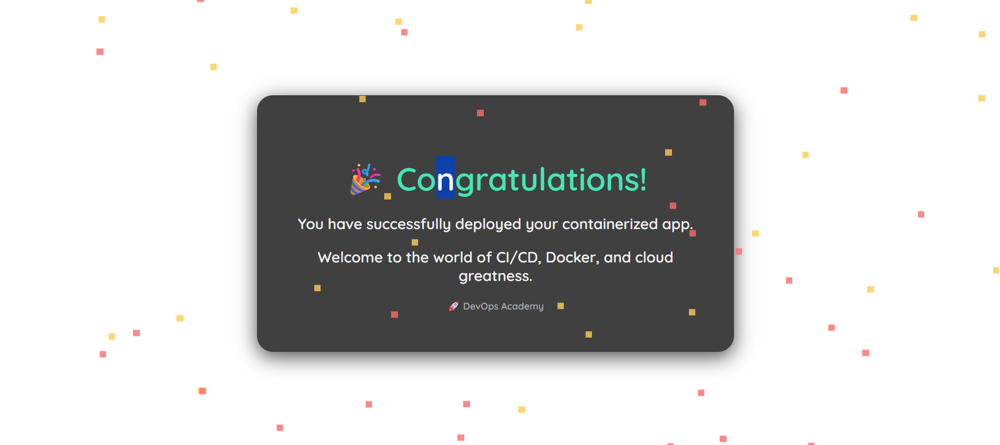

# 🚀 DevOps Academy – NGINX Static Site Deployment

Welcome to the **Dockerized NGINX Static Site** project from **DevOps Academy**. This simple project demonstrates how to deploy a beautifully styled static HTML page using [NGINX](https://nginx.org/) in a Docker container.


## 📁 Project Structure

```

Docker-devops-academy-nginx-/
├── Dockerfile
├── .dockerignore
└── index.html

````

---

## 📦 Prerequisites

- [Docker installed](https://docs.docker.com/get-docker/)
- Internet access for downloading the NGINX image

---

## 🛠️ How to Clone and Deploy

### 🔹 Step 1: Clone the Repo

```bash
git clone https://github.com/m-pasima/Docker-devops-academy-nginx-.git
cd Docker-devops-academy-nginx-
````

---

### 🔹 Step 2: Build the Docker Image

```bash
docker build -t devops-academy-nginx .
```

---

### 🔹 Step 3: Run the Container

```bash
docker run -d -p 8080:80 --name academy-nginx devops-academy-nginx
```

Access the site at:
**[http://localhost:8080](http://localhost:8080)** (or `http://<your-ec2-ip>:8080`)

---

### 🔹 Step 4: Test the Healthcheck (Optional)

This container uses a healthcheck to ensure NGINX is running correctly:

```Dockerfile
HEALTHCHECK CMD wget -q --spider http://localhost || exit 1
```

You can check it with:

```bash
docker inspect --format='{{json .State.Health}}' academy-nginx
```

---

## 🖼️ UI Preview

<p align="center">
  
</p>

---

## 🧼 .dockerignore

Keeps your image clean by excluding unnecessary files:

```
.git
*.log
*.zip
.DS_Store
.env
```

---

## ✅ Author

👩🏽‍💻 **Pasima** – DevOps Engineer & Cloud Educator
🔗 [DevOps Academy](https://github.com/m-pasima)

---

## 📄 License

This project is licensed under the MIT License.

---

Happy Deploying! 🚀
*Build. Ship. Celebrate.*

```

